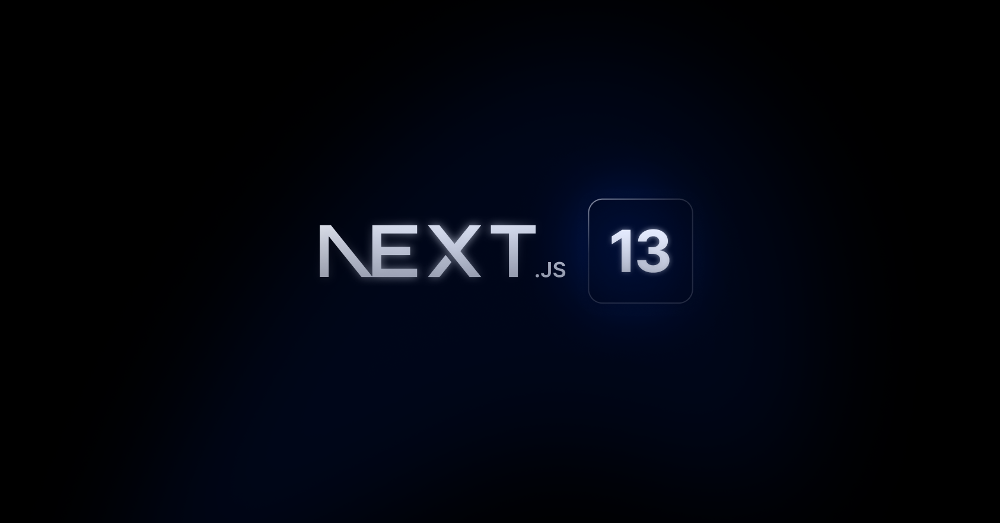

# Next.js 사전 공부
- 사전 공부 기간 : 2024.01.04 ~ 2024.01.05 ( 3일 )
- 새로운 프로젝트에 도입할 Next.js를 사전에 간략하게 공부하기 위해 생성한 레포지토리입니다.
- Next.js 13을 기준으로 공부했습니다.
- `코딩애플`님의 강의를 들으며, 간단한 기능들을 구현해보았습니다.
- mongoDB를 이용해 게시물 생성,수정,삭제를 구현하며 Next.js로 서버와의 통신하는 방법을 연습했습니다.
- 앱 라우팅 기능을 연습했습니다.
- 좀 더 다양한 기능 구현은 추후에 진행될 토이 프로젝트에서 사용할 예정입니다.